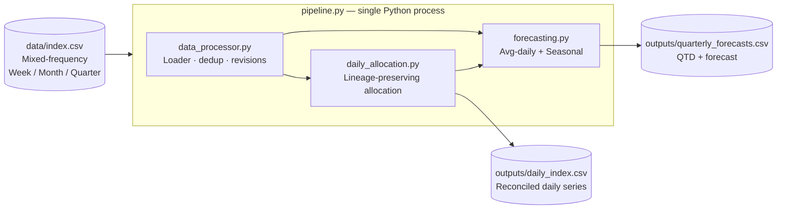

# Mixed-Frequency Index Data → Daily Reconciliation + Quarterly Forecasting

A Python data-engineering pipeline that converts mixed-frequency (week / month / quarter) financial index data into a reconciled daily dataset, then produces mid-quarter quarterly forecasts using avg-daily and seasonal methods. **Lineage-preserving, exactly-reconciling, deterministic** — the daily output sums back to the source period to floating-point tolerance, and every daily value can be traced to its exact source granularity.

> **About this project**
> Originally built as a take-home interview task for [Hatched Analytics](https://www.hatchedanalytics.com/) (alternative-data provider for institutional investors). Maintained as a portfolio piece demonstrating production-grade data-engineering practices: explicit auditability over theoretical elegance, exact reconciliation guarantees, and edge-case handling for revisions and duplicates.

## Data flow



## What this demonstrates

For reviewers — the engineering signals worth a few minutes:

- **Lineage preservation in time-series transformations.** Daily output retains `SOURCEDURATION`; no silent collapse across (week / month / quarter) granularities. Consumers pick which they trust.
- **Exact reconciliation as a tested invariant.** Sum of daily values over the original window equals the source period's value to floating-point tolerance. Reconciliation isn't aspirational; it's verifiable.
- **Two-method forecasting with explicit fallback.** Avg-daily extrapolation as a baseline; optional seasonal overlay using last year's intra-quarter pattern; clean fallback to avg-daily when last-year data is missing or zero.
- **Edge-case handling that production data needs.** Revisions (latest by `RELEASEDDATE`), duplicate anchors (last wins), negatives (clipped to 0), mixed-frequency anchors with explicit windowing (`(prev, curr]` semantics).
- **Reproducible Python pipeline.** Single CLI orchestrator, no notebooks in the production path, deterministic output for a given input.
- **Minimal dependencies.** `pandas` + `numpy` only. Easier to deploy, fewer transitive risks, lower bus factor for setup.

For the deeper rationale, see [Design Philosophy](#design-philosophy-why-this-approach) below.

<details>
<summary><b>Table of contents</b> (click to expand)</summary>

- [Overview](#overview)
- [Requirements](#requirements)
- [Project structure](#project-structure)
- [Installation](#installation)
- [Usage](#usage)
  - [Daily](#daily)
  - [Quarterly](#quarterly)
- [Daily conversion (Task 1)](#daily-conversion-task-1)
- [Forecasting (Task 2)](#forecasting-task-2)
- [Validation](#validation)
- [Assumptions](#assumptions)
- [Design Philosophy](#design-philosophy-why-this-approach)
- [Alternative approaches considered](#alternative-approaches-considered)

</details>

## Overview

This solution converts mixed‑frequency index data into a reconciled daily dataset and produces mid‑quarter quarterly estimates. The design emphasizes accuracy, auditability, and clarity.

**Deliverables**

- Daily CSV: `outputs/daily_index.csv`
- Quarterly CSV(s): `outputs/quarterly_forecasts.csv` (avg‑daily) and optionally `outputs/quarterly_forecasts_seasonal.csv`
- Well‑commented code and a single, simple CLI


## Requirements
- Python 3.10+
- pandas, numpy

## Installation
```bash
python -m venv venv
source venv/bin/activate
pip install -r requirements.txt
```
---

## Project structure
```
hatched_analytics_task/
├── pipeline.py              # CLI
├── src/
│   ├── __init__.py
│   ├── data_processor.py    # Loader
│   ├── daily_allocation.py  # Daily conversion logic
│   └── forecasting.py       # Quarterly estimation logic (avg & seasonal)
├── outputs/
│   ├── daily_index.csv
│   ├── quarterly_forecasts.csv
│   └── quarterly_forecasts_seasonal.csv
├── scripts/
│   └── compare_forecasts.py
└── README.md
```

## Usage
### Daily
```bash
python pipeline.py --input data/index.csv --output outputs/daily_index.csv
```

### Quarterly
```bash
# Avg‑daily forecast (uses latest date present in derived daily data as ASOF)
python pipeline.py --input data/index.csv --output outputs/quarterly_forecasts.csv --forecast-method avg

# Seasonal forecast (last year’s intra‑quarter pattern)
python pipeline.py --input data/index.csv --output outputs/quarterly_forecasts.csv --forecast-method seasonal

# Both methods (also writes *_seasonal.csv)
python pipeline.py --input data/index.csv --output outputs/quarterly_forecasts.csv --forecast-method both
```
Behavior
- If daily wasn’t generated in the same run, the pipeline derives daily in‑memory from `--input` before forecasting.
- ASOF for forecasting defaults to the latest `PERIODEND` present in the derived daily data.

---

## Daily conversion (Task 1)
### Principles
- No cross‑duration mixing: each `(TICKER, INDEXNAME, DURATION)` becomes its own daily series. 
   - Lineage is preserved with `SOURCEDURATION`.
- Exact reconciliation: per‑interval daily sums match the source period `VALUE` (float tolerance only).
- Clear windows: periods are allocated over `(prev PERIODEND, curr PERIODEND]` (exclusive start, inclusive end).

### Allocation rules
- Uniform split within each window so the sum equals the period `VALUE`.
- First‑period backfill (duration‑driven, calendar‑aware):
  - Week: 7 days
  - Month: start of prior calendar month → anchor
  - Quarter: start of prior calendar quarter → anchor
  - Year: start of prior calendar year → anchor
  - Mid‑month: 15 days
  - Custom Quarter: ~91 days (reviewable default)

### Data handling
- Lineage: `SOURCEDURATION` retained in the daily output; no cross‑duration collapsing in Task 1.
- Cumulative: `CUMULATIVEVALUE` is a global running sum over emitted daily `VALUE`s per `(TICKER, INDEXNAME, SOURCEDURATION)`.
- Negatives: clipped to 0 in the loader; zeros are allowed and preserved.
- Revisions & duplicates: if `RELEASEDDATE` exists, keep the latest per `(TICKER, INDEXNAME, DURATION, PERIODEND)`; duplicate anchors on the same day keep the last.

Output format
- Daily (Task 1): `TICKER, DURATION=Day, PERIODEND (YYYY‑MM‑DD), INDEXNAME, VALUE, CUMULATIVEVALUE, SOURCEDURATION`


### Example

Raw input
```
TICKER | DURATION | PERIODEND | VALUE
ADBE   | Month    | 2021-03-01 | 300
```

Derived daily output
```
TICKER | DURATION | PERIODEND | VALUE | SOURCEDURATION
ADBE   | Day      | 2021-02-02 | 10.71 | Month
ADBE   | Day      | 2021-02-03 | 10.71 | Month
...    | ...      | ...        | ...   | ...
ADBE   | Day      | 2021-03-01 | 10.71 | Month
```
Here, 300 is spread evenly over 28 days between Feb-01 and Mar-01.

---

## Forecasting (Task 2)
### Methods
- Avg‑daily extrapolation (baseline)
  - `avg_daily = QTD / days_elapsed`
  - `forecast = QTD + avg_daily * remaining_days`
  - Source priority when multiple granularities exist: 
      - Month > Week > Quarter > Custom Quarter > Mid‑month > Year
  - Forecast source priority favors Month over Week because months tile cleanly into quarters and are less noisy; weeks can straddle quarter boundaries.
- Seasonality vs last year (optional)
  - Map current day‑of‑quarter index to last year’s same calendar quarter
  - `growth = current_QTD / last_year_QTD_same_day_index`
  - `forecast = growth * last_year_full_quarter_total`
  - Falls back to avg‑daily if last‑year data is missing/zero

### Notes
- Quarter bounds: calendar‑based by default (`_quarter_start/_quarter_end`). 
   - Swap to fiscal calendars when available.
- Presentation: `QTD` and `FORECAST` rounded to 3 decimals in outputs.
- Forecast output: `TICKER, INDEXNAME, ASOFDATE, QUARTER_START, QUARTER_END, DAYS_ELAPSED, DAYS_IN_QUARTER, QTD, FORECAST, SOURCEDURATION, METHOD`
- AS‑OF defaults to the latest available daily date in the quarter (no look‑ahead); forecasting functions clamp to quarter bounds.

---

## Validation
- Reconciliation: for each source period, sum of daily over `(prev, curr]` equals the reported `VALUE`.
- Coverage: daily rows are continuous within each `(TICKER, INDEXNAME, SOURCEDURATION)`.
- Utilities: `tests/test_daily_validation.py` for checks; `scripts/compare_forecasts.py` for method comparison.


---

## Assumptions
- Month `PERIODEND` dated on the 1st refers to the prior month; weekly/quarterly follow standard calendar end semantics.
- Backfill windows are duration‑driven to ensure “earliest to latest” daily coverage for each series.
- No cross‑duration collapsing in daily output; consumers choose which `SOURCEDURATION` to use.

- Dates are normalized to midnight (no timezone). `PERIODEND` is treated as a date boundary, not a timestamp.
- Revisions: when multiple rows exist for the same `(TICKER, INDEXNAME, DURATION, PERIODEND)`, the latest by `RELEASEDDATE` is kept (if available); exact duplicates are dropped.
- Negatives: any negative `VALUE` in the raw input is clipped to `0.0` during load; zeros are allowed and propagated.
- Windows: allocation uses `(prev PERIODEND, curr PERIODEND]` (exclusive start, inclusive end) across all durations.
- Duration semantics used for first‑period backfill:
  - Week: 7 days prior to the first anchor
  - Month: start of the prior calendar month → first anchor
  - Quarter: start of the prior calendar quarter → first anchor
  - Year: start of the prior calendar year → first anchor
  - Mid‑month: 15 days prior
  - Custom Quarter: ~91 days prior (reviewable default when fiscal calendar is unknown)
- Coverage: daily rows span from the first backfill start through the last available anchor for each `(TICKER, INDEXNAME, SOURCEDURATION)`.
- Rounding: `QTD` and `FORECAST` in forecast outputs are rounded to 3 decimals for presentation; internal calculations keep full precision.

---
## Design Philosophy: Why This Approach?

**The core challenge**: There's no single "correct" way to disaggregate mixed-frequency time series into daily data. Each approach involves trade-offs between accuracy, simplicity, and auditability.

**My data engineering perspective**: In production systems, **traceability and exactness** trump theoretical elegance. When business stakeholders ask "Where did this daily number come from?", the answer must be unambiguous.

**Why I chose lineage-preserving allocation:**
- **Complete auditability**: Every daily value can be traced back to its exact source period and duration
- **No silent assumptions**: We don't assume intra-period shapes, seasonal patterns, or cross-duration relationships  
- **Exact reconciliation**: Sum of daily values over any period equals the reported total (machine precision)
- **Production-ready**: Handles data revisions, duplicates, and edge cases deterministically

This approach scales: add new durations, handle fiscal calendars, implement confidence intervals—all while maintaining the audit trail that production data systems require.

---

## Alternative approaches considered
- **Pick one source granularity (e.g., Month) and discard others**  
  - *Pros*: Simpler, avoids parallel series.  
  - *Cons*: Risk of throwing away higher-resolution (e.g., Week) data; less flexible for downstream use.  

- **Merge sources into a single “canonical” daily stream by priority**  
  - *Pros*: Cleaner downstream interface, one series per index.  
  - *Cons*: Requires policy decisions (Week vs Month vs Quarter); could hide discrepancies without traceability.  

- **Use weighted allocation (day-of-week, holiday effects, or last-year intra-period patterns)**  
  - *Pros*: Captures known seasonality or business cycles; more realistic daily signals.  
  - *Cons*: Needs extra metadata; harder to guarantee sums reconcile; more assumptions baked in.  

- **Model-based forecasting (regression, time-series models, ML)**  

Why not those?
They’re valid in specific contexts, but I chose lineage-preserving allocation as the baseline because it guarantees reconciliation, preserves flexibility, and makes future enhancements safe to layer on top without losing transparency.